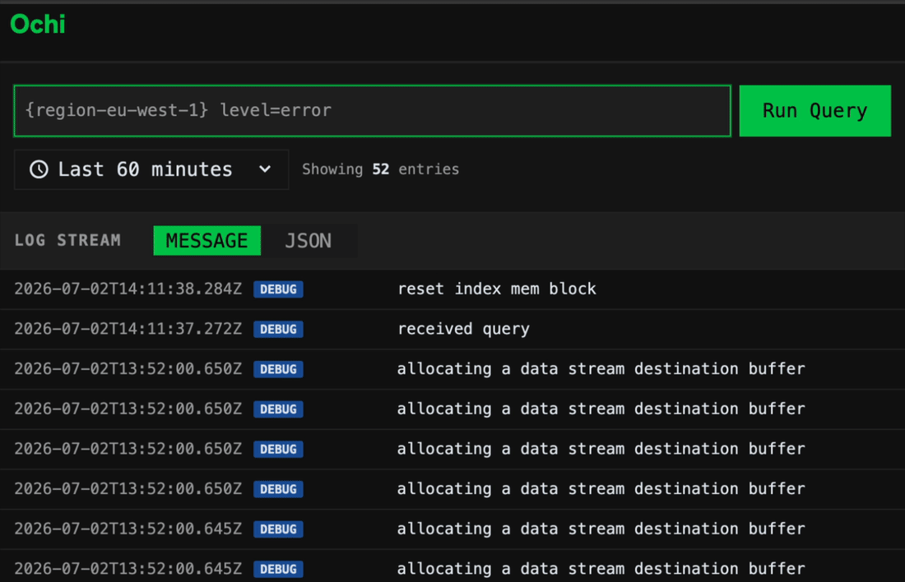

# What, one more query language?

Well, yes.

It's very unfortunate, but every time series store will bring its own query language except a couple based on SQL.
Although I'm convienced SQL doesn't fit time series, especially schemaless;

There are many reason.

First, you can't adopt an existing one as a software owner.
To provide a unique experience one has to control UX, versioning and query implementation together with the rest of the solutions: storage, ingestion, schema any many more.
Adopting existing language creates a race to adopt new features and being behind.
As a result it's very hard to make the UI compatible and reusable, so it gives no benefits at all.

Second, we won't ever have a "standard" timeseries language.
[Kusto](https://learn.microsoft.com/en-us/kusto/query/?view=microsoft-fabric) has moved very close to it, but still it contains such concepts as tables, schema that are incompatible with schemaless storages, or as we call Ochi "schemaless time value log store".

Either can't we adopt SQL due it's schema nature.
Perhaps it's easy to pickup due to experience, but it limits many features we want to provide to the users.

## The experience we look for

I couldn't find an existing language that would satisfy me at every angle because they shuffle data scan and processing operations, therefore impacting performance and delegating the responsibility for the efficient queries to the users, as a result the engineers spend a lot of time to learn the language to build more efficient query or load the system more than they should because the query is not efficient.

We want to gift grep experience to log viewers with a few exceptions:
1. the file to view is infinitely large, so the time range limit is necessary, imagine it as head and tail pipes required with -n parameter.
2. the flat grep is infinitely slow to scan, so indexing is involved at large scale
3. pipe ordering matters for post processing and may significantly impact performance, therefore we want to delegate this responsibility to the query execution engine in order to provide predictable good experience, but not changing the pipes order which may provide different results, but rather give pipes as a designated statement of the query designed to show it order of execution.

As a result Logs Ochi Query Language (Loql) supports the statements to hold all the constrains above
- time range to limit the data `[-365d, now]` to share large or limited enough dataset
- optional, but highly encouraged stream indexing: `{env=prod}` to give quickly enough designated output
- regular conditions to filter the data: `(value=x OR value=z)`
- not implemented yet, but in the design and development roadmap the processing pipes `| sort(id)`, they are executed in the very end when the resulted output is predetermined

## Did we solve the problem?

Unfortunately no.

There are many open questions we are unable to solve yet due to the current ingestion implementation, but we want to dig into it:
1. `_msg` key, do we need it as a specific key? Or is it rudiment coming from Loki ingestion protocol we decided to inherit? or use an empty key as we do internally to the query may look like `(=timeout)`?
2. Support of regex and wildcard operations, do we need to do both in order to provide a simpler, but more efficient way for sub-matching (%like% way) or determine by the query if it contains regex tokens
3. why do we make users query index and values as `{env=prod} (key=error)`, as it was noticed it looks like `WHERE env=prod HAVING key=error`, and to clause statements is the least problem, but how do the users know what is in the index key=value? Most of the time engineers don't configure collector agents and they don't know what possible values are there to query what they need. Even worse, if a colleague didn't share you a query you might never find a necessary index key for your service and query something that doesn't belong to you

### We are up to hear your feedback

Storage is still in pre-alpha, but it's [available](https://github.com/ochi-team/ochi) as well as the [grafana datasource](https://github.com/ochi-team/ochi-grafana)

Follow our journey.

[Github](https://github.com/ochi-team/ochi)
[Discord](https://discord.gg/AsCKpCNp5c)

